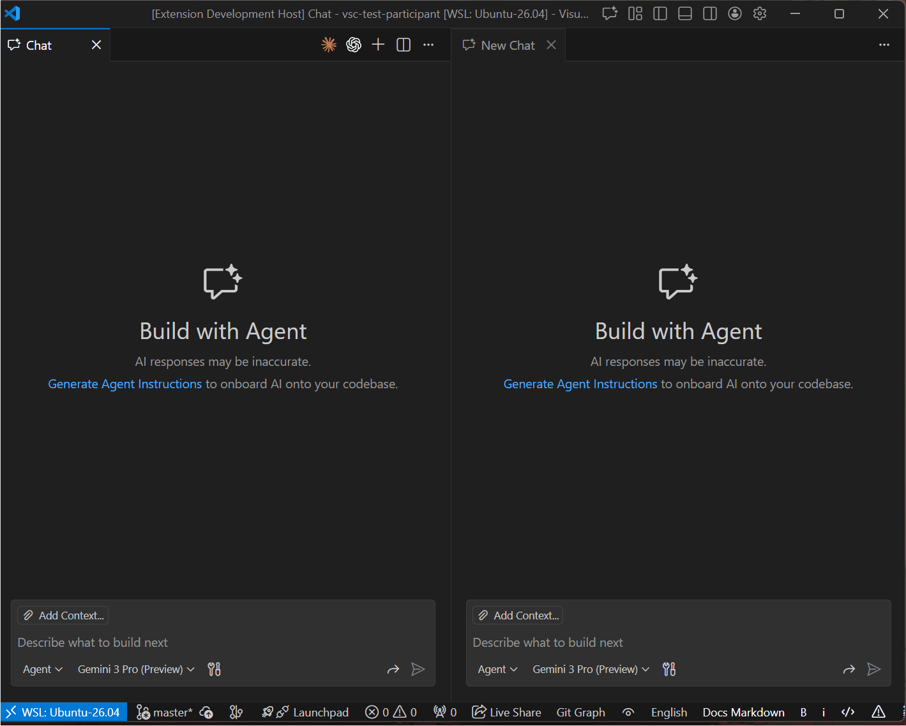

# Copilot CLI Agents

Copilot extension for integrating multiple Code Agent CLIs directly into VS Code Copilot Chat.

## Introduction

## Motivation

GitHub Copilot provides a highly structured and well-integrated development experience, offering fine-grained control for Agent Coding. However, as a product specialized for coding, its underlying models often come with restricted Context Windows.

On the other hand, pure models like Gemini and Claude (such as Sonnet 4.5 with its 1M context window) provide extensive context capabilities. Switching contexts or applications to leverage these large-context models creates unnecessary friction. This extension aims to bridge this gap, allowing developers to utilize these powerful CLIs without leaving the VS Code Copilot Agent environment.

## Features

### Chat Participants

This extension adds the following chat participants to GitHub Copilot:

- **@gemini**: Google Gemini AI Assistant
- **@claude**: Anthropic Claude AI Assistant

> **Note**: Since Gemini and Claude are used directly as CLIs, Copilot's request processing is not used.

### Commands

This extension provides the following commands:

- **Scaffold Code Agents**: Creates the recommended project structure for Code Agent integration
  - Command ID: `copilot-cli-agents.scaffold-llm`
  - Creates `.github/copilot-instructions.md` and related directories (`agents`, `prompts`, `instructions`)
  - Sets up `GEMINI.md` and `CLAUDE.md` symlinks at the project root for agent-specific instructions

## Usage

1. Install and log in to Gemini CLI or Claude Code.
   - [Gemini CLI](https://geminicli.com/)
   - [Claude Code](https://claude.com/product/claude-code)
2. Open GitHub Copilot Chat in VS Code.
3. Type `@gemini` or `@claude` followed by your query.

## Configuration

You can customize the behavior of CLI Agents through VS Code settings:

### Model Selection

**Claude:**
- `copilot-cli-agents.claude.model`: Choose from `sonnet`, `opus`, or `haiku` (default: `sonnet`)
- `copilot-cli-agents.claude.customModel`: Use a custom model name (e.g., `claude-sonnet-4-5-20250929`)
  - When set, this overrides the `model` setting above

**Gemini:**
- `copilot-cli-agents.gemini.model`: Specify Gemini model (default: `gemini-2.0-flash-exp`)

### Other Settings

- `copilot-cli-agents.timeout`: Request timeout in milliseconds (default: `120000` = 2 minutes)
- `copilot-cli-agents.claude.cliPath`: Custom path to Claude CLI executable (optional)
- `copilot-cli-agents.gemini.cliPath`: Custom path to Gemini CLI executable (optional)

### Quick Model Switching

You can also use the **"Change Claude Model"** command from the Command Palette (`Ctrl+Shift+P` or `Cmd+Shift+P`) for quick model switching.

## Important Notes

1. When the Participant is first called, a `{workspaceFolder}/.github/copilot-cli-agents.json` file is created.
   > **Note**: This is used to restore the chat session between Copilot and the CLI. It is safe to add it to `.gitignore`.

2. Even if you use GitHub Copilot's 'Add Context' feature, it is not attached.
   > **Note**: This is intended to use the CLI cleanly without polluting its own features. If you wish to perform advanced tasks, please use the CLI directly after restoring the session.

3. The working directory for all CLIs is the open path in VS Code.
   > **Note**: This allows you to purely utilize the instruction files and capabilities within the project.

4. The only available tool for the CLI is the 'Web Search' tool.
   > **Note**: This project is intended to utilize other CLIs as 'auxiliary tools' using GitHub Copilot.
