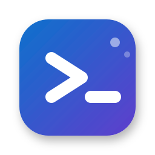

    
    <h1>GitHub Copilot CLI Agents</h1>
    <h3><em>One chat. Every AI.</em></h3>

    <strong>Copilot extension for integrating multiple Code Agent CLIs directly into VS Code Copilot Chat.</strong>

---

## Introduction

## Motivation

GitHub Copilot provides a highly structured and well-integrated development experience, offering fine-grained control for Agent Coding. However, as a product specialized for coding, its underlying models often come with restricted Context Windows.

On the other hand, pure models like Gemini and Claude (such as Sonnet 4.5 with its 1M context window) provide extensive context capabilities. Switching contexts or applications to leverage these large-context models creates unnecessary friction. This extension aims to bridge this gap, allowing developers to utilize these powerful CLIs without leaving the VS Code Copilot Agent environment.

## Features

### Chat Participants

- **@gemini**: Google Gemini AI Assistant
- **@claude**: Anthropic Claude AI Assistant
- **@codex**: OpenAI Codex AI Assistant

### Slash Commands

- **/doctor**: Check CLI installation status
- **/session**: Display current session ID
- **/handoff**: Open interactive CLI terminal with current session
- **/passAgent**: Pass Custom Agent mode instructions to CLI (Gemini only)

### Commands

- **Scaffold Code Agents**: Create recommended project structure

### Configuration

- **Model Selection**: Select the underlying model for each agent
- **Allowed Tools**: Configure which tools each agent can use

> 📖 **For detailed documentation with demos, visit the [Wiki](https://github.com/sbluemin/vsc-copilot-cli-agents/wiki).**

## Quick Start

1. Install and log in to [Gemini CLI](https://geminicli.com/), [Claude Code](https://claude.com/product/claude-code), or [Codex CLI](https://github.com/openai/codex)
2. Open GitHub Copilot Chat in VS Code
3. Type `@gemini`, `@claude`, or `@codex` followed by your query

## Important Notes

- Context from Copilot's 'Add Context' feature is not attached to CLI queries
- Working directory is the currently open VS Code workspace
- Write operation tools are disabled by default (use `/handoff` for full capabilities)

## License

MIT
